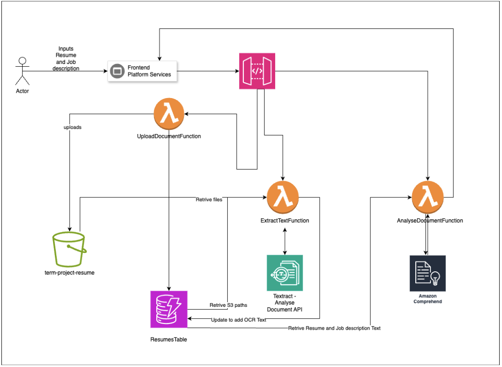

# AI Powered Resume Rating System - README

## Project Overview
The AI-Powered Resume Rating System is a serverless web application designed to assist job seekers and recruiters by evaluating the relevance of resumes against job descriptions. It leverages AWS cloud infrastructure to provide a seamless, scalable, and secure platform for resume evaluation.

**Deployed Link:**  
[Resume Rating System](http://resume-rating-b00963832.us-east-1.elasticbeanstalk.com/)

## Key Features
- **Natural Language Processing (NLP):** Extracts key information from resumes and job descriptions.
- **OCR Integration:** Processes resumes in various formats using Amazon Textract.
- **Scalability:** Auto-scales based on traffic and data volume spikes.
- **High Availability:** Minimal downtime with reliable AWS services.
- **Security:** Built-in security features like AWS IAM, encryption, and HTTPS.

## System Architecture

The system uses a microservices architecture with the following components:
- **Frontend:** React.js for the user interface.
- **Backend:** Python Lambda functions to handle business logic and AWS service interactions.
- **Storage:** User data stored in DynamoDB, while resume and job description files are stored in S3.
- **API Gateway:** Manages communication between the frontend and backend services.
- **AWS Services:**  
  - **Amazon Comprehend:** For text analysis.
  - **Amazon Textract:** For optical character recognition (OCR) of resumes.

## Selected AWS Services

### 1. Compute
- **AWS Lambda:** Serverless, event-driven function execution.
- **Elastic Beanstalk:** Simplifies Docker container deployment.
  
### 2. Storage
- **DynamoDB:** NoSQL database for user data and analysis results.
- **S3:** Object storage for resume and job description files.

### 3. Network
- **API Gateway:** Manages API requests with automatic scaling and security.

### 4. General
- **Amazon Comprehend:** Performs NLP to evaluate resumes.
- **Amazon Textract:** Extracts text from uploaded documents.

## How to Deploy
1. **Frontend:**
   - Developed using JavaScript and React.js.
   - Hosted on AWS Elastic Beanstalk.
   
2. **Backend:**
   - Lambda functions written in Python.
   - Managed via AWS CloudFormation for Infrastructure as Code (IaC).

3. **Infrastructure:**
   - Provisioned using AWS CloudFormation, ensuring consistency and scalability.

## Security Features
- **HTTPS:** Secure communication between frontend and backend.
- **IAM Roles:** Each Lambda function has a designated IAM role with least privilege.
- **Encryption:**  
  - DynamoDB data is encrypted at rest using AWS KMS.
  - S3 bucket policies and encryption secure resume files.

## Future Enhancements
- **Advanced Reporting:** Detailed resume analysis reports.
- **Job Portal Integration:** Automatically fetch job descriptions from portals.
- **User Analytics:** Provide users with insights on their resume performance over time.

## System Requirements
To reproduce this system on a private cloud, you would need:
- Compute resources like high-performance servers.
- Scalable storage solutions similar to S3 and DynamoDB.
- Secure networking equipment and encryption mechanisms.
- OCR and NLP software similar to Amazon Textract and Comprehend.

## References
For detailed documentation, refer to the official AWS documentation for the services used:
- [AWS Lambda Documentation](https://docs.aws.amazon.com/lambda/latest/dg/welcome.html)
- [Amazon DynamoDB Documentation](https://docs.aws.amazon.com/amazondynamodb/latest/developerguide/Introduction.html)
- [Amazon Comprehend Documentation](https://docs.aws.amazon.com/comprehend/latest/dg/what-is.html)
- [Amazon Textract Documentation](https://docs.aws.amazon.com/textract/latest/dg/what-is.html)

This README provides an overview of the AI-Powered Resume Rating System project, its architecture, and deployment instructions【4†source】.